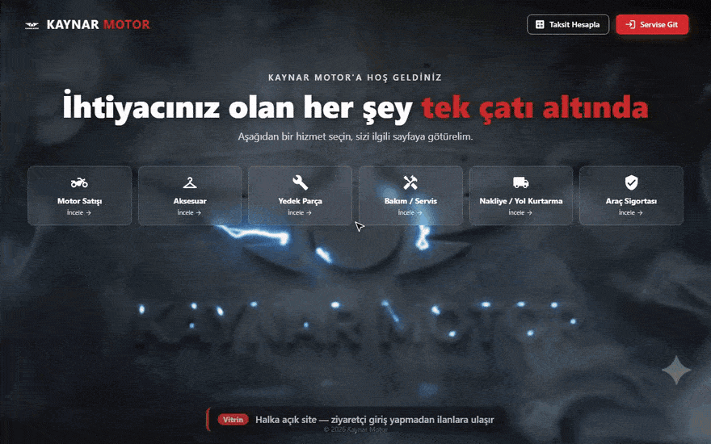
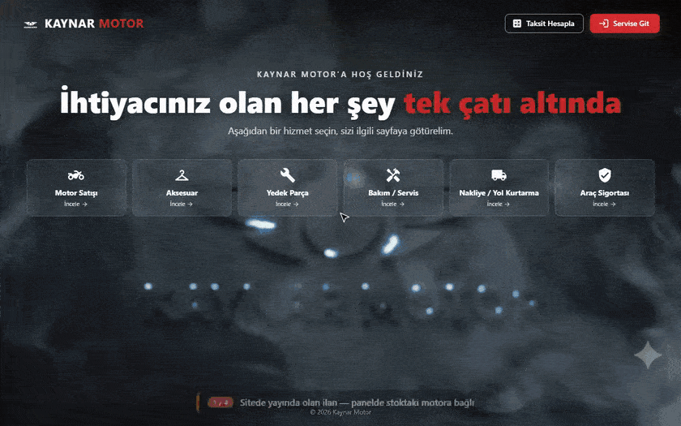
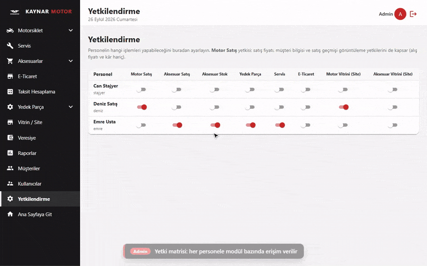
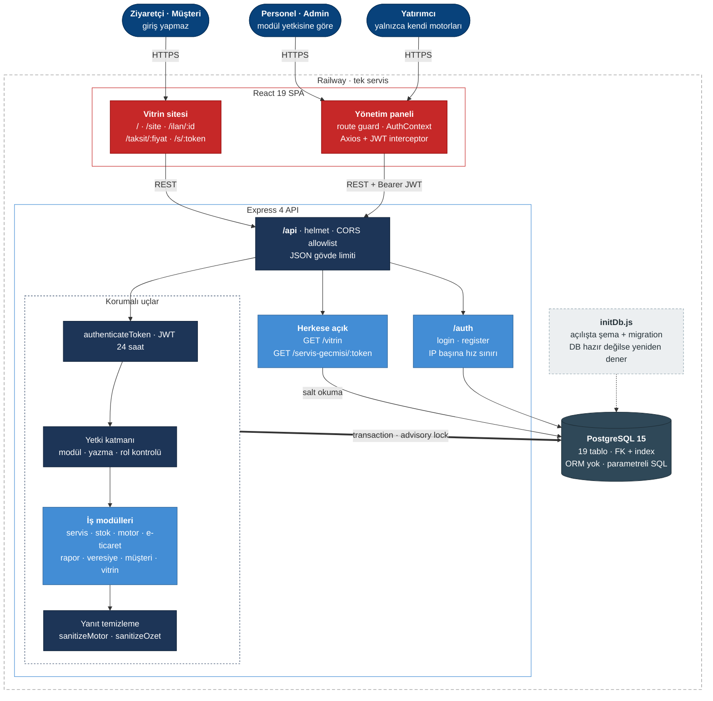
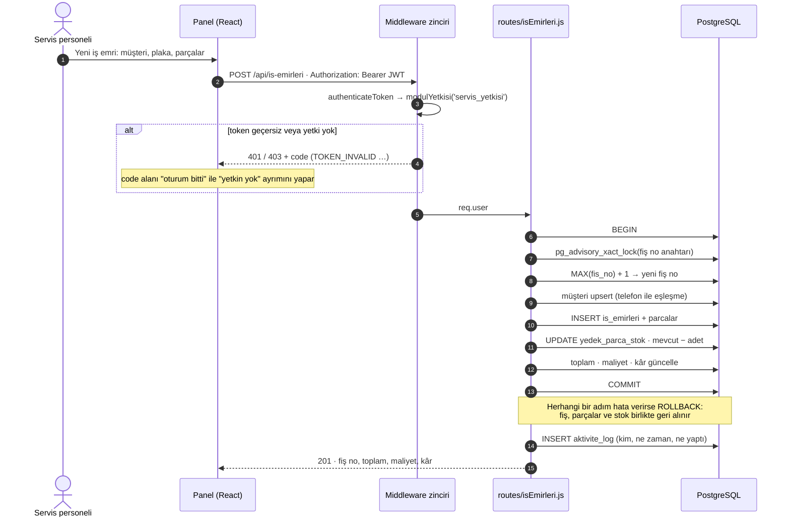
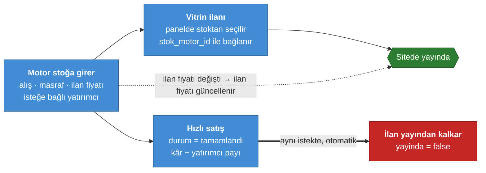

<h1 align="center">Kaynar Motor — Dealership ERP & Digital Showroom</h1>

<p align="center">
  Motosiklet servisi, 2. el alım-satım, aksesuar ve yedek parça stoğu, e-ticaret ve<br>
  yatırımcı ortaklıklarını tek panelde yöneten uçtan uca işletme yönetim sistemi.
</p>

<p align="center">
  
  
  
  
  
  
</p>

<p align="center">
  
</p>

---


<!-- english-overview:start -->
## English Overview

Kaynar Motor is a production dealership ERP and digital showroom integrating motorcycle service, used-vehicle sales, accessory and spare-parts inventory, e-commerce profitability, investor profit sharing, debt tracking, reporting, and a public showroom.

### My Contribution

I developed the React interface, Node.js/Express API, PostgreSQL data model, authentication and permission system, reporting tools, barcode and QR workflows, public showroom integration, and Railway deployment.

### Engineering Challenges

- Making multi-step sales, service, payment, and stock updates transaction-safe
- Restricting investor and staff visibility at the API response level
- Publishing and removing showroom listings automatically as inventory status changes
- Exposing privacy-safe QR service history without leaking cost or customer data
- Recovering cleanly from database cold starts and deployment-time connection delays

**See it in action:** the [Nasıl Çalışır](#nasıl-çalışır) section has four end-to-end recordings: public showroom, service work order with QR history, inventory ↔ showroom sync, and role-based access. The [Mimari](#mimari) section has the C4 container view, the request lifecycle, and the listing lifecycle.
<!-- english-overview:end -->

## Genel Bakış

Kaynar Motor için geliştirilen dealership ERP ve dijital showroom, işletmenin günlük operasyonunu tek sistemde
toplar: servise gelen aracın iş emrinden, 2. el motosikletin alım-satım kârına, aksesuar
envanterinden pazaryeri satışlarının net kâr hesabına kadar.

Sistem iki yüzlüdür:

- **Yönetim paneli** — personelin rolüne ve yetkilerine göre şekillenen, giriş gerektiren iç panel.
- **Vitrin sitesi** — [kaynarmotor.com.tr](https://kaynarmotor.com.tr) üzerinden yayınlanan, giriş gerektirmeyen ilan ve tanıtım sitesi. Stoktaki motora bağlanan ilanın fiyatı stokla birlikte güncellenir, motor satıldığında ilan kendiliğinden yayından kalkar.

Proje gerçek bir işletmede aktif olarak kullanılmaktadır.

> Bu depodaki ekran görüntüleri, demo kayıtları ve örnek kayıtlar demo amacıyla üretilmiş
> **temsili verilerdir**; gerçek müşteri bilgisi içermez. Demo kayıtlarındaki motosiklet
> fotoğrafları CC0 lisanslıdır.

## Nasıl Çalışır

Aşağıdaki kayıtlar, uygulamanın ayrı bir demo veritabanı üzerinde uçtan uca çalıştırılmasıyla
alınmıştır. Her adımın ne yaptığı kaydın altındaki açıklama bandında yazar.

### 1 · Vitrin — ziyaretçinin gözünden

Giriş gerektirmeyen site: sıfır / ikinci el ayrımı, yayındaki ilanlardan otomatik üretilen marka
filtresi, ilan detayı ve müşteriye link olarak gönderilebilen taksit tablosu.

<p align="center"></p>

### 2 · Servis — iş emrinden müşterinin QR sayfasına

Telefonla kayıtlı müşteri eşleşmesi, stoktan arama ve barkodla parça ekleme, tek transaction'da
kaydedilen iş emri ve fiş bazlı kâr. Plakaya özel QR etiketi, müşteriye giriş gerektirmeyen servis
geçmişi sayfasını açar. Bu sayfaya maliyet, kâr ve iletişim bilgisi API'den hiç gönderilmez.

<p align="center"></p>

### 3 · Stok ↔ Vitrin senkronu

Stoktaki ilan fiyatı değişince sitedeki ilanın fiyatı da güncellenir. Motor satılınca kâr ve
yatırımcı payı hesaplanır, bağlı ilan elle bir işlem gerekmeden yayından kalkar.

<p align="center"></p>

### 4 · Yetkilendirme — aynı ekran, farklı roller

Admin personele modül yetkisi verir ve bekleyen kaydı onaylar. Yatırımcı yalnızca ortağı olduğu
motorları ve kendi kâr payını görür. "Vitrin modundaki" yatırımcı tüm satılık stoğu görür ama alış
fiyatı ile kâr sunucu yanıtından silinmiştir.

<p align="center"></p>

## Ekran Görüntüleri

<table>
  <tr>
    <td width="50%"><br><sub><b>Vitrin / Site</b> — giriş gerektirmeyen halka açık ilan sitesi</sub></td>
    <td width="50%"><br><sub><b>Raporlar</b> — modül bazlı gelir, maliyet ve kâr analizi</sub></td>
  </tr>
  <tr>
    <td width="50%"><br><sub><b>Motor Stok</b> — 2. el envanter ve yatırımcı ortaklıkları</sub></td>
    <td width="50%"><br><sub><b>Yetkilendirme</b> — personel bazlı ince taneli yetki matrisi</sub></td>
  </tr>
  <tr>
    <td width="50%"><br><sub><b>Aksesuar Stoğu</b> — barkodlu envanter yönetimi</sub></td>
    <td width="50%"><br><sub><b>E-Ticaret</b> — platform bazlı komisyon ve net kâr hesabı</sub></td>
  </tr>
</table>

<details>
<summary>Diğer ekranlar</summary>
<br>

| | |
|---|---|
|  |  |
| **Giriş** | **2. El Motor Alım-Satım** |
|  |  |
| **Yedek Parça Stoğu** | **Veresiye / Açık Borç Takibi** |
|  |  |
| **Kullanıcı Yönetimi** | **Müşteri Kayıtları** |

</details>

## Özellikler

### Servis Yönetimi
İş emri oluşturma, otomatik fiş numarası, takılan parça ve işçilik kalemleri, fiş bazlı
kâr hesabı, teslim alan/eden takibi, plaka ve hasar kaydı. Kullanılan yedek parçalar iş
emri kaydedildiği anda aynı transaction içinde stoktan düşer. İş emri düzenlenirse ya da silinirse
stok farkı geri alınır.

Her araca **plaka bazlı bir QR kod** üretilir; müşteri bu kodu okutarak kendi servis
geçmişini giriş yapmadan görüntüleyebilir. Bu sayfada yalnızca yapılan işlemler ve tutar
gösterilir — maliyet, kâr ve iletişim bilgileri asla dönülmez.

### 2. El Motosiklet Alım-Satım
Alış/satış/noter bedelleri, masraf ve komisyon takibi, otomatik kâr hesabı. Yatırımcı
ortaklı motosikletler için kâr paylaşımı; satılık araçlar tek tuşla vitrine bağlanır.

### Vitrin Sitesi
Motor, aksesuar, yedek parça ve hizmet (bakım, nakliye, sigorta) kategorileri. Motor ilanları
**Sıfır** ve **İkinci El** olarak ayrı listelenir. Marka filtresi yayındaki ilanlardan otomatik
üretilir. Segment, cc ve km filtreleri, çoklu görsel ve video galerisi, hasar kaydı bulunur.
Stoka bağlı ilanlarda tek bir **İlan Fiyatı** kullanılır; fiyat stokta değişince ilan da güncellenir.
Kategori bazında iletişim kişisi ve WhatsApp bağlantısı vardır. Vitrindeki sıralama panelden yönetilir.

### Stok Yönetimi
Aksesuar ve yedek parça için ayrı envanterler. Barkod veya stok kodu ile arama, toplu
ürün girişi, satış tamamlandığında otomatik stok düşümü ve iptal edilen satışta stok iadesi.

### E-Ticaret
Trendyol, Hepsiburada, N11 ve Shoppier gibi platformlara özel komisyon, KDV ve kargo
formülleriyle ürün başına **net kâr** hesabı.

### Yatırımcı Sistemi
Motosiklet sermayesine ortak olan yatırımcılar için ayrı bir rol: yalnızca kendi
araçlarını ve kârlarını görürler. İsteğe bağlı "vitrin modu" ile tüm satılık stoğu
sadece ilan fiyatıyla görebilirler — alış fiyatı ve kâr gizli kalır.

### Finans ve Raporlama
Günlük ve tarih aralıklı raporlar, modül bazlı kâr analizi, personel performansı,
yatırımcı özeti. Tüm modüllerdeki açık ödemeler tek "Veresiye" ekranında toplanır.
Nakit fiyat üzerinden 3/6/9/12 ay taksit tablosu üretilir ve müşteriyle salt-okunur
bir bağlantı olarak paylaşılabilir.

### Kullanıcı ve Yetki Yönetimi
Admin onaylı kayıt, modül bazlı ve alan bazlı ince taneli yetkilendirme, tüm işlemlerin
kim tarafından ne zaman yapıldığını kaydeden aktivite logu.

## Teknoloji Yığını

| Katman | Teknolojiler |
|---|---|
| **Frontend** | React 19, React Router 7, Material UI 7, Axios, date-fns, jsbarcode, qrcode, react-to-print |
| **Backend** | Node.js 22, Express 4, JSON Web Token, bcryptjs, helmet, express-rate-limit |
| **Veritabanı** | PostgreSQL 15 — ORM kullanılmadan, `pg` ile doğrudan parametreli SQL |
| **Altyapı** | Railway (nixpacks), Heroku uyumlu `Procfile` |

## Mimari

Backend ve frontend tek repoda (monorepo) durur. Production'da tek bir Railway servisi olarak
çalışır: Express hem `/api` uçlarını hem de React build'ini aynı domain'den servis eder.

### Sistem görünümü

[C4 modelinin](https://c4model.com/) konteyner seviyesi: kimler sistemi kullanıyor, istek hangi
katmanlardan geçiyor ve veri nerede duruyor.



İstekler üç yoldan geçer:

- **Herkese açık uçlar** yalnızca okuma yapar ve hassas alan döndürmez.
- **`/auth`** giriş ve kayıt uçlarıdır; IP başına hız sınırı vardır.
- **Korumalı uçlar** JWT doğrulaması ve yetki kontrolünden geçer. Yanıt istemciye gitmeden önce
  kullanıcının göremeyeceği alanlardan temizlenir.

### Bir isteğin yolculuğu — yeni iş emri

Bir iş emri kaydı; fiş numarası, müşteri, parçalar ve stok düşümüyle birlikte tek transaction'da
yürür. Adımlardan biri başarısız olursa hiçbiri kalıcı olmaz.



### Stok ↔ vitrin yaşam döngüsü

Vitrindeki motor ilanı stoktaki kayda `stok_motor_id` ile bağlıdır. Bu yüzden site her zaman
stokla aynı durumu gösterir.



### Tasarım kararları

- **Şema kod içinde yönetilir.** ORM yoktur. Tablolar ve migration'lar `config/initDb.js` içinde `CREATE TABLE IF NOT EXISTS` ve kademeli `ALTER TABLE ... ADD COLUMN IF NOT EXISTS` ile tanımlanır. Sunucu her açılışta şemayı eksiksiz hâle getirir, bu da deploy'u tek adıma indirir.
- **Yetkilendirme sunucu tarafındadır.** Arayüzdeki route guard'lar yalnızca gezinmeyi düzenler; asıl kontrol `backend/middleware/yetki.js` içindedir ve API'ye bağlıdır. Hassas alanlar (kâr, alış fiyatı, müşteri bilgisi) yetkisi olmayan kullanıcının yanıtından sunucuda temizlenir. Gizleme arayüzde değil, veri katmanında yapılır.
- **Okuma serbest, yazma yetkili.** Stok gibi birçok ekranın aradığı uçlarda GET istekleri açıktır, POST/PUT/PATCH/DELETE ise modül yetkisine bağlıdır (`yazmaYetkisi`).
- **Veritabanına dayanıklı başlangıç.** Backend veritabanı henüz hazır değilken de ayağa kalkar (`/api/health` yanıt verir) ve bağlantıyı artan gecikmelerle yeniden dener. Bu, Railway'deki soğuk başlatma senaryolarına karşı dayanıklılık sağlar.
- **Para ve stok işlemleri transaction içindedir.** Çok adımlı yazma işlemleri (iş emri + parçalar + stok düşümü) tek transaction'da yürür. Fiş numarası üretimi advisory lock ile serileştirilir.
- **Denetim izi.** Giriş/çıkış ve başarısız giriş denemeleri (IP ile), kayıt/onay işlemleri, iş emri ve motor satışının oluşturma/güncelleme/silme adımları, aksesuar ve e-ticaret satışları, işlemi yapan kullanıcıyla birlikte `aktivite_log` tablosuna yazılır.

## Kurulum

**Gereksinimler:** Node.js 20+ ve PostgreSQL 14+

```bash
git clone https://github.com/salih12s/KaynarMotorCRM.git
cd KaynarMotorCRM
npm run install:all
```

Ortam dosyalarını şablonlardan oluşturun:

```bash
cp backend/.env.example backend/.env
cp frontend/.env.example frontend/.env
```

### Ortam Değişkenleri

**`backend/.env`**

| Değişken | Açıklama |
|---|---|
| `NODE_ENV` | `development` veya `production` |
| `PORT` | Sunucu portu (varsayılan `5000`) |
| `DATABASE_URL` | Tek parça bağlantı adresi (verilirse `DB_*` yerine kullanılır) |
| `DB_HOST` `DB_PORT` `DB_NAME` `DB_USER` `DB_PASSWORD` | Ayrı ayrı bağlantı bilgileri |
| `JWT_SECRET` | JWT imzalama anahtarı |
| `FRONTEND_URL` | Ek CORS origin'i. Frontend backend tarafından servis edildiğinde gerekmez; yalnızca farklı bir alan adından istek atılacaksa tanımlanır. `development` modunda tüm origin'lere izin verilir |
| `ADMIN_INITIAL_PASSWORD` | Yalnızca ilk kurulumda: boş veritabanında `admin` hesabının şifresi |

`JWT_SECRET` üretmek için:

```bash
node -e "console.log(require('crypto').randomBytes(32).toString('hex'))"
```

**`frontend/.env`**

| Değişken | Açıklama |
|---|---|
| `REACT_APP_API_URL` | Backend API adresi (örn. `http://localhost:5000/api`) |

## Çalıştırma

```bash
npm run dev      # backend + frontend eş zamanlı (nodemon + react-scripts)
npm run build    # frontend production build
npm start        # production: backend, frontend/build'i statik serve eder
```

Sağlık kontrolü: `GET /api/health`

İlk açılışta veritabanı şeması otomatik oluşturulur. `ADMIN_INITIAL_PASSWORD` tanımlıysa
`admin` kullanıcısı bu şifreyle kurulur.

## Proje Yapısı

```
KaynarMotorCRM/
├── backend/
│   ├── server.js                # Express app, CORS, route mount, DB init
│   ├── middleware/
│   │   ├── auth.js              # JWT doğrulama, admin kontrolü
│   │   ├── yetki.js             # Modül ve rol bazlı yetkilendirme
│   │   └── rateLimit.js         # Kimlik doğrulama uçlarında hız sınırlama
│   ├── config/
│   │   ├── db.js                # PostgreSQL bağlantı havuzu
│   │   ├── initDb.js            # Şema, migration'lar ve index'ler
│   │   ├── activityLogger.js    # Aktivite/audit kaydı
│   │   └── musteriHelper.js     # Otomatik müşteri eşleştirme
│   ├── routes/                  # 13 route dosyası
│   └── scripts/                 # Tek seferlik veri aktarım script'leri
├── frontend/
│   └── src/
│       ├── components/          # Layout — role göre şekillenen menü
│       ├── context/             # AuthContext, ThemeContext
│       ├── pages/               # 23 sayfa
│       ├── services/api.js      # Axios katmanı ve oturum yönetimi
│       └── App.jsx              # Route tanımları ve guard'lar
└── docs/
    ├── demo/                    # Uçtan uca demo kayıtları (GIF)
    └── screenshots/             # Ekran görüntüleri
```

## Roller ve Yetkilendirme

Kimlik doğrulama JWT ile yapılır (24 saat geçerli), şifreler `bcryptjs` ile hash'lenir.
Yeni kayıtlar admin onayı bekler.

**Roller**

| Rol | Kapsam |
|---|---|
| `admin` | Tam erişim |
| `personel` | Yalnızca kendisine verilen modüller |
| `yatirimci` | Yalnızca sermayesine ortak olduğu motosikletler |

**Modül yetkileri** — `servis`, `aksesuar`, `aksesuar_stok`, `yedek_parca`, `motor_satis`,
`eticaret`, `motor_vitrin`, `aksesuar_vitrin`

**Alan bazlı görüntüleme yetkileri** — `liste_fiyati_gor`, `alis_fiyati_gor`,
`satis_fiyati_gor`, `kar_gor`, `musteri_gor`, `satis_gecmisi_gor`

Bu yetkiler API katmanında uygulanır: `sanitizeMotor()` ve `sanitizeOzet()` fonksiyonları,
yetkisi olmayan kullanıcının yanıtından hassas alanları hem tekil kayıtlarda hem de
toplamlarda çıkarır.

## API

Tüm uçlar `/api` altındadır. `vitrin` ve QR ile erişilen servis geçmişi dışındaki tüm
route'lar JWT ile korunur.

| Mount | İşlev |
|---|---|
| `/api/auth` | Kayıt, giriş, admin onayı, yetki güncelleme, aktivite logları |
| `/api/musteriler` | Müşteri kayıtları; arama uçları tüm modüllerdeki formlar tarafından kullanılır |
| `/api/is-emirleri` | Servis iş emirleri, parça listesi, kâr hesabı, QR token |
| `/api/aksesuarlar` · `/api/aksesuar-stok` | Aksesuar satışları ve envanteri |
| `/api/yedek-parcalar` · `/api/yedek-parca-stok` | Yedek parça satışları ve envanteri |
| `/api/ikinci-el-motor` | 2. el alım-satım, yetkiye göre alan filtreleme |
| `/api/eticaret` | Pazaryeri platformları ve satışları |
| `/api/raporlar` | Günlük/aralıklı raporlar, yatırımcı özeti |
| `/api/veresiye` | Tüm modüllerdeki açık ödemelerin konsolide listesi |
| `/api/vitrin` | Halka açık vitrin + ilan yönetimi |
| `/api/servis-gecmisi` | QR ile erişilen müşteri servis geçmişi |

## Veritabanı

19 tablo; ilişkiler yabancı anahtarlarla, sık sorgulanan kolonlar index'lerle tanımlıdır.

| Alan | Tablolar |
|---|---|
| Kullanıcı | `kullanicilar`, `aktivite_log` |
| Müşteri | `musteriler` |
| Servis | `is_emirleri`, `parcalar`, `servis_qr_tokenler` |
| Aksesuar | `aksesuar_stok`, `aksesuarlar`, `aksesuar_parcalar` |
| Yedek parça | `yedek_parca_stok`, `yedek_parcalar` |
| Motosiklet | `ikinci_el_motorlar` |
| E-ticaret | `eticaret_platformlar`, `eticaret_satislar` |
| Vitrin | `vitrin_urunleri`, `vitrin_gorseller`, `vitrin_videolar`, `vitrin_segmentler`, `vitrin_kategori_iletisim` |

## Deploy

Railway üzerinde `nixpacks.toml` ile derlenir:

1. `frontend`: bağımlılıklar + production build
2. `backend`: bağımlılıklar
3. Başlangıç: `cd backend && node server.js`

Production'da `NODE_ENV=production` ayarlanır; backend `frontend/build` klasörünü statik
olarak serve eder ve SPA route'larını `index.html`'e yönlendirir. Heroku tarzı dağıtım
için `Procfile` de mevcuttur.

## Lisans

Bu depo portföy ve inceleme amacıyla herkese açık olarak yayınlanmıştır.
Tüm hakları saklıdır © Kaynar Motor.
