<h1 align="center">Kaynar Motor CRM</h1>

<p align="center">
  Motosiklet servisi, 2. el alım-satım, aksesuar ve yedek parça stoğu, e-ticaret ve<br>
  yatırımcı ortaklıklarını tek panelde yöneten uçtan uca işletme yönetim sistemi.
</p>

<p align="center">
  
  
  
  
  
  
</p>

<p align="center">
  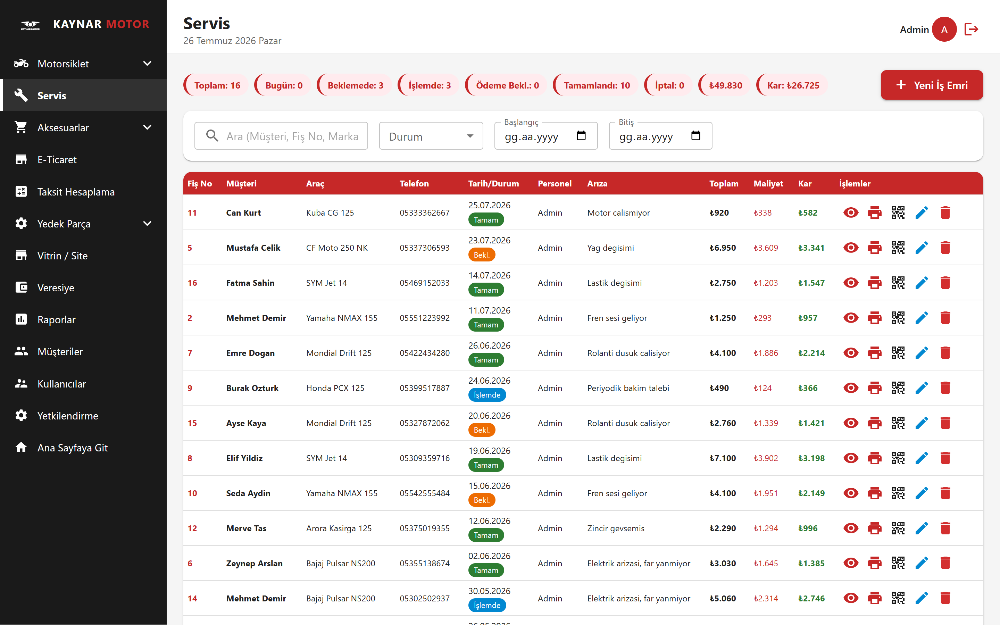
</p>

---

## Genel Bakış

Kaynar Motor CRM, bir motosiklet işletmesinin günlük operasyonunun tamamını tek sistemde
toplar: servise gelen aracın iş emrinden, 2. el motosikletin alım-satım kârına, aksesuar
envanterinden pazaryeri satışlarının net kâr hesabına kadar.

Sistem iki yüzlüdür:

- **Yönetim paneli** — personelin rolüne ve yetkilerine göre şekillenen, giriş gerektiren iç panel.
- **Vitrin sitesi** — `kaynarmotor.com.tr` üzerinden yayınlanan, giriş gerektirmeyen ilan ve tanıtım sitesi. Panelde satılık olarak işaretlenen motosiklet otomatik olarak vitrine düşer, satıldığında ilan kendiliğinden yayından kalkar.

Proje gerçek bir işletmede aktif olarak kullanılmaktadır.

> Bu depodaki ekran görüntüleri ve örnek kayıtlar demo amacıyla üretilmiş **temsili
> verilerdir**; gerçek müşteri bilgisi içermez.

## Ekran Görüntüleri

<table>
  <tr>
    <td width="50%">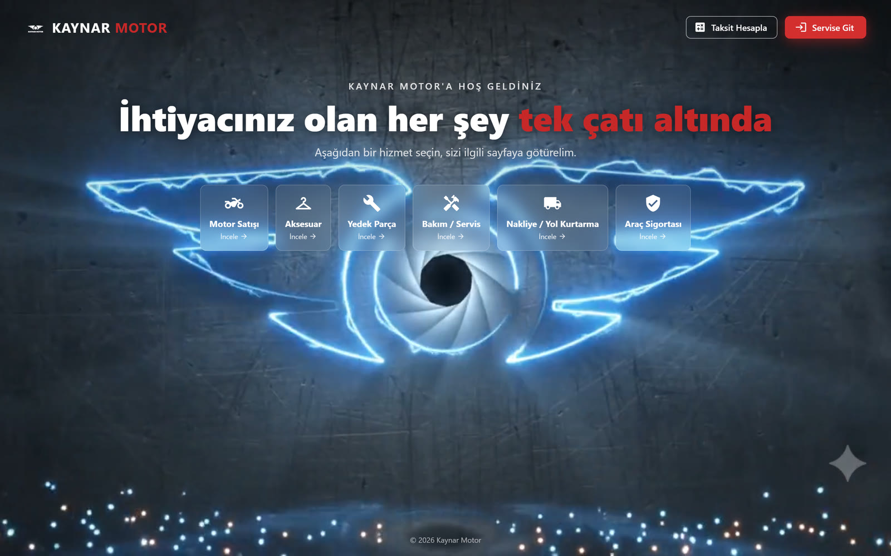<br><sub><b>Vitrin / Site</b> — giriş gerektirmeyen halka açık ilan sitesi</sub></td>
    <td width="50%">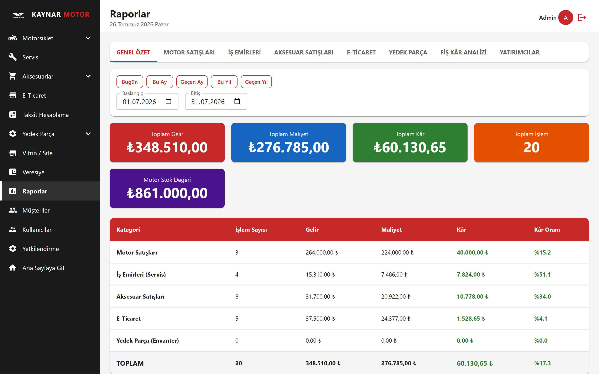<br><sub><b>Raporlar</b> — modül bazlı gelir, maliyet ve kâr analizi</sub></td>
  </tr>
  <tr>
    <td width="50%">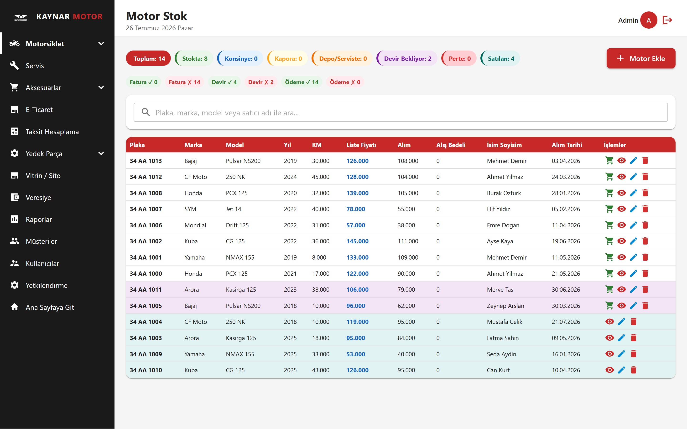<br><sub><b>Motor Stok</b> — 2. el envanter ve yatırımcı ortaklıkları</sub></td>
    <td width="50%">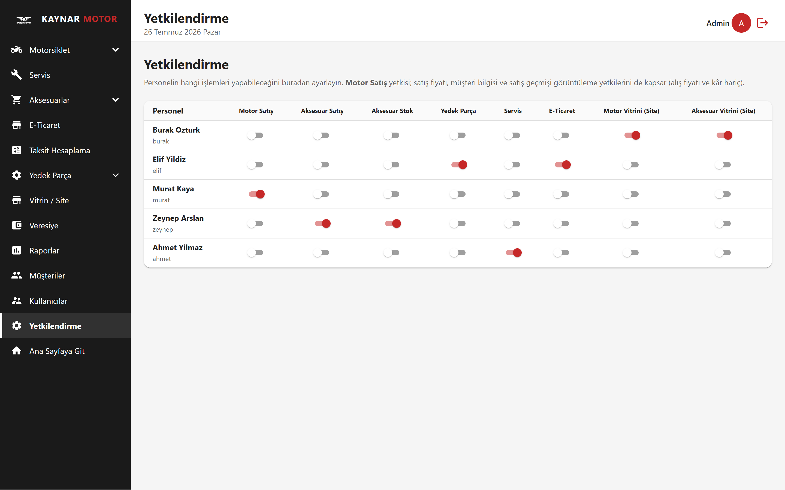<br><sub><b>Yetkilendirme</b> — personel bazlı ince taneli yetki matrisi</sub></td>
  </tr>
  <tr>
    <td width="50%">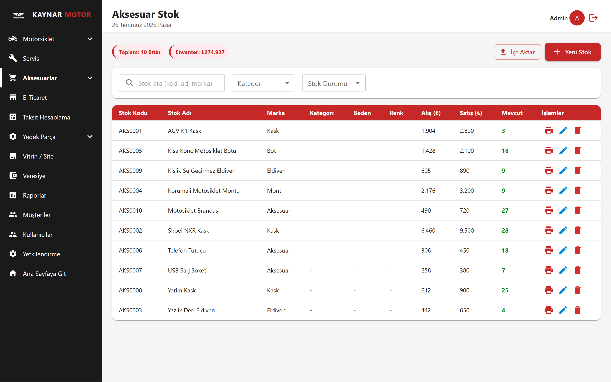<br><sub><b>Aksesuar Stoğu</b> — barkodlu envanter yönetimi</sub></td>
    <td width="50%">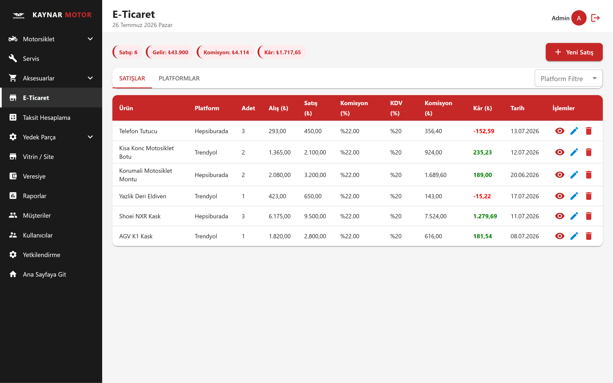<br><sub><b>E-Ticaret</b> — platform bazlı komisyon ve net kâr hesabı</sub></td>
  </tr>
</table>

<details>
<summary>Diğer ekranlar</summary>
<br>

| | |
|---|---|
| 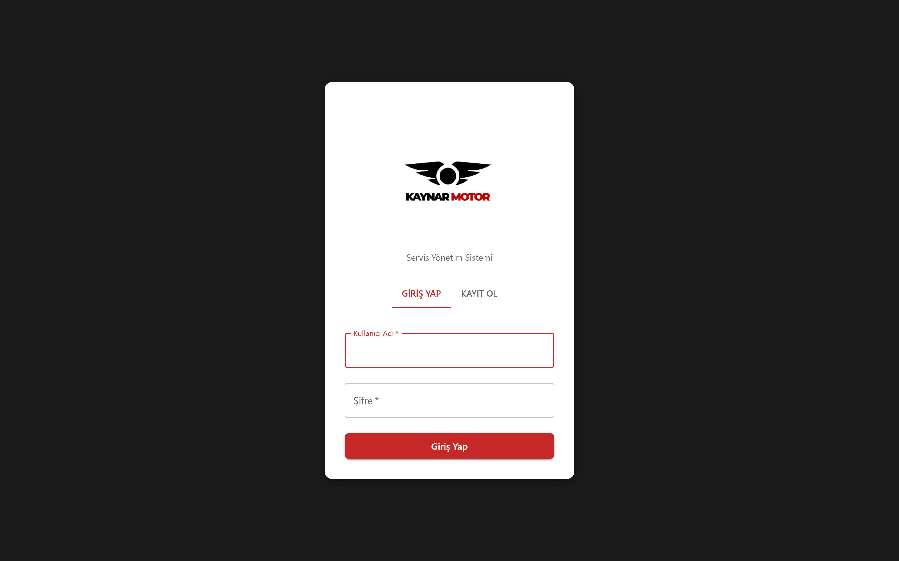 | 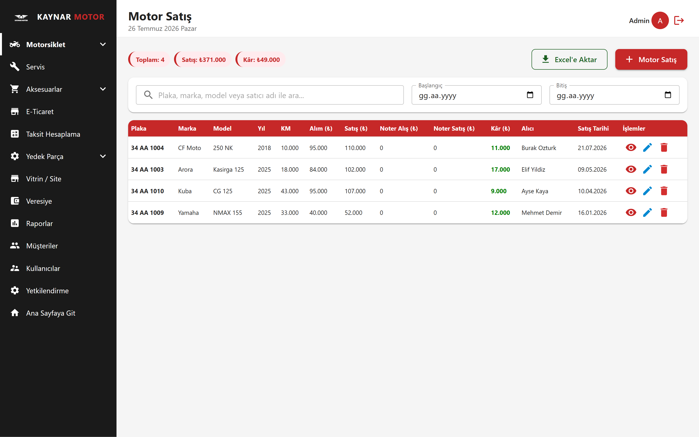 |
| **Giriş** | **2. El Motor Alım-Satım** |
| 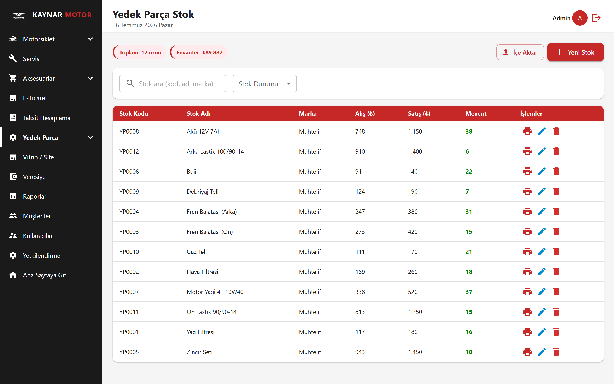 | 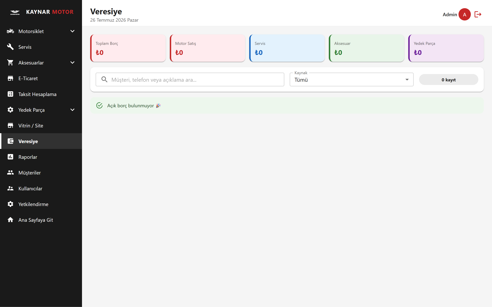 |
| **Yedek Parça Stoğu** | **Veresiye / Açık Borç Takibi** |
| 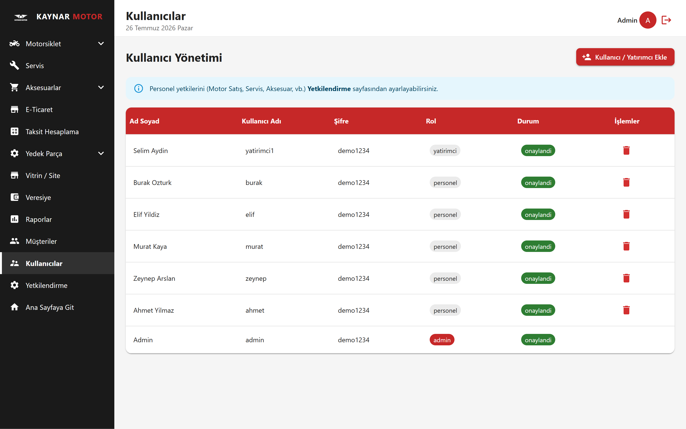 | 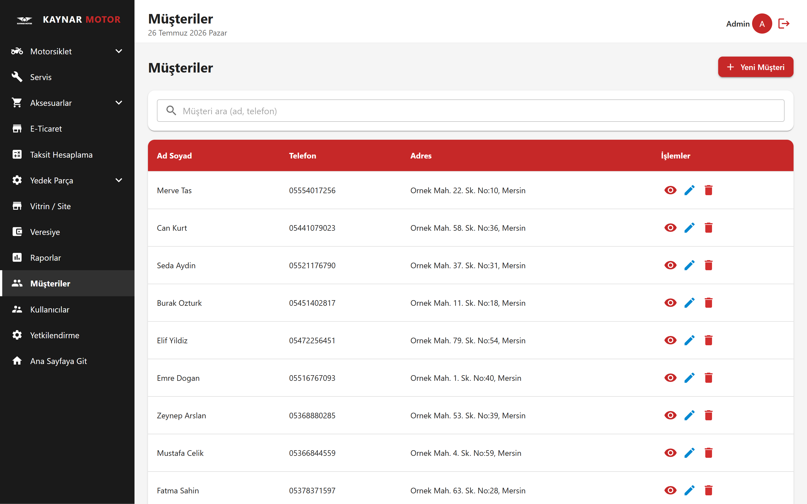 |
| **Kullanıcı Yönetimi** | **Müşteri Kayıtları** |

</details>

## Özellikler

### Servis Yönetimi
İş emri oluşturma, otomatik fiş numarası, takılan parça ve işçilik kalemleri, fiş bazlı
kâr hesabı, teslim alan/eden takibi, plaka ve hasar kaydı. Kullanılan yedek parçalar iş
emri tamamlandığında stoktan otomatik düşer.

Her araca **plaka bazlı bir QR kod** üretilir; müşteri bu kodu okutarak kendi servis
geçmişini giriş yapmadan görüntüleyebilir. Bu sayfada yalnızca yapılan işlemler ve tutar
gösterilir — maliyet, kâr ve iletişim bilgileri asla dönülmez.

### 2. El Motosiklet Alım-Satım
Alış/satış/noter bedelleri, masraf ve komisyon takibi, otomatik kâr hesabı. Yatırımcı
ortaklı motosikletler için kâr paylaşımı; satılık araçlar tek tuşla vitrine bağlanır.

### Stok Yönetimi
Aksesuar ve yedek parça için ayrı envanterler. Barkod veya stok kodu ile arama, toplu
ürün girişi, satış tamamlandığında otomatik stok düşümü ve iptal edilen satışta stok iadesi.

### E-Ticaret
Trendyol, Hepsiburada, N11 ve Shoppier gibi platformlara özel komisyon, KDV ve kargo
formülleriyle ürün başına **net kâr** hesabı.

### Yatırımcı Sistemi
Motosiklet sermayesine ortak olan yatırımcılar için ayrı bir rol: yalnızca kendi
araçlarını ve kârlarını görürler. İsteğe bağlı "vitrin modu" ile tüm satılık stoğu
sadece liste fiyatıyla görebilirler — alış fiyatı ve kâr gizli kalır.

### Finans ve Raporlama
Günlük ve tarih aralıklı raporlar, modül bazlı kâr analizi, personel performansı,
yatırımcı özeti. Tüm modüllerdeki açık ödemeler tek "Veresiye" ekranında toplanır.
Nakit fiyat üzerinden 3/6/9/12 ay taksit tablosu üretilir ve müşteriyle salt-okunur
bir bağlantı olarak paylaşılabilir.

### Kullanıcı ve Yetki Yönetimi
Admin onaylı kayıt, modül bazlı ve alan bazlı ince taneli yetkilendirme, tüm işlemlerin
kim tarafından ne zaman yapıldığını kaydeden aktivite logu.

## Teknoloji Yığını

| Katman | Teknolojiler |
|---|---|
| **Frontend** | React 19, React Router 7, Material UI 7, Axios, date-fns, jsbarcode, qrcode, react-to-print |
| **Backend** | Node.js 22, Express 4, JSON Web Token, bcryptjs, helmet, express-rate-limit |
| **Veritabanı** | PostgreSQL 15 — ORM kullanılmadan, `pg` ile doğrudan parametreli SQL |
| **Altyapı** | Railway (nixpacks), Heroku uyumlu `Procfile` |

## Mimari

Backend ve frontend'i tek repoda barındıran bir monorepo yapısındadır.

```
İstemci (React SPA)
      │  REST + JWT
      ▼
Express API ── middleware: kimlik doğrulama → yetkilendirme → hız sınırlama
      │
      ▼
PostgreSQL ── şema kod içinde yönetilir (initDb.js)
```

Öne çıkan tasarım kararları:

- **Şema kod içinde yönetilir.** ORM yoktur; tablolar ve migration'lar `config/initDb.js` içinde `CREATE TABLE IF NOT EXISTS` ve kademeli `ALTER TABLE ... ADD COLUMN IF NOT EXISTS` ile tanımlanır. Sunucu her açılışta şemayı eksiksiz hâle getirir, bu da deploy'u tek adıma indirir.
- **Yetkilendirme sunucu tarafındadır.** Arayüzdeki route guard'ları yalnızca gezinmeyi düzenler; asıl kontrol `backend/middleware/yetki.js` içindedir ve API'ye bağlıdır. Hassas alanlar (kâr, alış fiyatı, müşteri bilgisi) yetkisi olmayan kullanıcının yanıtından sunucuda temizlenir — gizleme arayüzde değil, veri katmanındadır.
- **Veritabanına dayanıklı başlangıç.** Backend, veritabanı henüz hazır değilken de ayağa kalkar (`/api/health` yanıt verir) ve bağlantıyı artan gecikmelerle yeniden dener. Bu, Railway'in soğuk başlatma senaryolarına karşı dayanıklılık sağlar.
- **Para ve stok işlemleri transaction içindedir.** Çok adımlı yazma işlemleri (iş emri + parçalar + stok düşümü) tek transaction'da yürür; fiş numarası üretimi advisory lock ile serileştirilir.

## Kurulum

**Gereksinimler:** Node.js 20+ ve PostgreSQL 14+

```bash
git clone https://github.com/salih12s/KaynarMotorCRM.git
cd KaynarMotorCRM
npm run install:all
```

Ortam dosyalarını şablonlardan oluşturun:

```bash
cp backend/.env.example backend/.env
cp frontend/.env.example frontend/.env
```

### Ortam Değişkenleri

**`backend/.env`**

| Değişken | Açıklama |
|---|---|
| `NODE_ENV` | `development` veya `production` |
| `PORT` | Sunucu portu (varsayılan `5000`) |
| `DATABASE_URL` | Tek parça bağlantı adresi (verilirse `DB_*` yerine kullanılır) |
| `DB_HOST` `DB_PORT` `DB_NAME` `DB_USER` `DB_PASSWORD` | Ayrı ayrı bağlantı bilgileri |
| `JWT_SECRET` | JWT imzalama anahtarı |
| `FRONTEND_URL` | CORS için izin verilen origin (production'da gereklidir) |
| `ADMIN_INITIAL_PASSWORD` | Yalnızca ilk kurulumda: boş veritabanında `admin` hesabının şifresi |

`JWT_SECRET` üretmek için:

```bash
node -e "console.log(require('crypto').randomBytes(32).toString('hex'))"
```

**`frontend/.env`**

| Değişken | Açıklama |
|---|---|
| `REACT_APP_API_URL` | Backend API adresi (örn. `http://localhost:5000/api`) |

## Çalıştırma

```bash
npm run dev      # backend + frontend eş zamanlı (nodemon + react-scripts)
npm run build    # frontend production build
npm start        # production: backend, frontend/build'i statik serve eder
```

Sağlık kontrolü: `GET /api/health`

İlk açılışta veritabanı şeması otomatik oluşturulur. `ADMIN_INITIAL_PASSWORD` tanımlıysa
`admin` kullanıcısı bu şifreyle kurulur.

## Proje Yapısı

```
KaynarMotorCRM/
├── backend/
│   ├── server.js                # Express app, CORS, route mount, DB init
│   ├── middleware/
│   │   ├── auth.js              # JWT doğrulama, admin kontrolü
│   │   ├── yetki.js             # Modül ve rol bazlı yetkilendirme
│   │   └── rateLimit.js         # Kimlik doğrulama uçlarında hız sınırlama
│   ├── config/
│   │   ├── db.js                # PostgreSQL bağlantı havuzu
│   │   ├── initDb.js            # Şema, migration'lar ve index'ler
│   │   ├── activityLogger.js    # Aktivite/audit kaydı
│   │   └── musteriHelper.js     # Otomatik müşteri eşleştirme
│   ├── routes/                  # 13 route dosyası
│   └── scripts/                 # Tek seferlik veri aktarım script'leri
├── frontend/
│   └── src/
│       ├── components/          # Layout — role göre şekillenen menü
│       ├── context/             # AuthContext, ThemeContext
│       ├── pages/               # 23 sayfa
│       ├── services/api.js      # Axios katmanı ve oturum yönetimi
│       └── App.jsx              # Route tanımları ve guard'lar
└── docs/screenshots/            # Ekran görüntüleri
```

## Roller ve Yetkilendirme

Kimlik doğrulama JWT ile yapılır (24 saat geçerli), şifreler `bcryptjs` ile hash'lenir.
Yeni kayıtlar admin onayı bekler.

**Roller**

| Rol | Kapsam |
|---|---|
| `admin` | Tam erişim |
| `personel` | Yalnızca kendisine verilen modüller |
| `yatirimci` | Yalnızca sermayesine ortak olduğu motosikletler |

**Modül yetkileri** — `servis`, `aksesuar`, `aksesuar_stok`, `yedek_parca`, `motor_satis`,
`eticaret`, `motor_vitrin`, `aksesuar_vitrin`

**Alan bazlı görüntüleme yetkileri** — `liste_fiyati_gor`, `alis_fiyati_gor`,
`satis_fiyati_gor`, `kar_gor`, `musteri_gor`, `satis_gecmisi_gor`

Bu yetkiler API katmanında uygulanır: `sanitizeMotor()` ve `sanitizeOzet()` fonksiyonları,
yetkisi olmayan kullanıcının yanıtından hassas alanları hem tekil kayıtlarda hem de
toplamlarda çıkarır.

## API

Tüm uçlar `/api` altındadır. `vitrin` ve QR ile erişilen servis geçmişi dışındaki tüm
route'lar JWT ile korunur.

| Mount | İşlev |
|---|---|
| `/api/auth` | Kayıt, giriş, admin onayı, yetki güncelleme, aktivite logları |
| `/api/musteriler` | Müşteri kayıtları; arama uçları tüm modüllerdeki formlar tarafından kullanılır |
| `/api/is-emirleri` | Servis iş emirleri, parça listesi, kâr hesabı, QR token |
| `/api/aksesuarlar` · `/api/aksesuar-stok` | Aksesuar satışları ve envanteri |
| `/api/yedek-parcalar` · `/api/yedek-parca-stok` | Yedek parça satışları ve envanteri |
| `/api/ikinci-el-motor` | 2. el alım-satım, yetkiye göre alan filtreleme |
| `/api/eticaret` | Pazaryeri platformları ve satışları |
| `/api/raporlar` | Günlük/aralıklı raporlar, yatırımcı özeti |
| `/api/veresiye` | Tüm modüllerdeki açık ödemelerin konsolide listesi |
| `/api/vitrin` | Halka açık vitrin + ilan yönetimi |
| `/api/servis-gecmisi` | QR ile erişilen müşteri servis geçmişi |

## Veritabanı

19 tablo; ilişkiler yabancı anahtarlarla, sık sorgulanan kolonlar index'lerle tanımlıdır.

| Alan | Tablolar |
|---|---|
| Kullanıcı | `kullanicilar`, `aktivite_log` |
| Müşteri | `musteriler` |
| Servis | `is_emirleri`, `parcalar`, `servis_qr_tokenler` |
| Aksesuar | `aksesuar_stok`, `aksesuarlar`, `aksesuar_parcalar` |
| Yedek parça | `yedek_parca_stok`, `yedek_parcalar` |
| Motosiklet | `ikinci_el_motorlar` |
| E-ticaret | `eticaret_platformlar`, `eticaret_satislar` |
| Vitrin | `vitrin_urunleri`, `vitrin_gorseller`, `vitrin_videolar`, `vitrin_segmentler`, `vitrin_kategori_iletisim` |

## Deploy

Railway üzerinde `nixpacks.toml` ile derlenir:

1. `frontend`: bağımlılıklar + production build
2. `backend`: bağımlılıklar
3. Başlangıç: `cd backend && node server.js`

Production'da `NODE_ENV=production` ayarlanır; backend `frontend/build` klasörünü statik
olarak serve eder ve SPA route'larını `index.html`'e yönlendirir. Heroku tarzı dağıtım
için `Procfile` de mevcuttur.

## Lisans

Bu depo portföy ve inceleme amacıyla herkese açık olarak yayınlanmıştır.
Tüm hakları saklıdır © Kaynar Motor.
